# 📊 Simulation Technique - Sève Pure V2.0
## Modélisation de Performance et Impact Environnemental

### 🌍 Executive Summary
> **Impact Total Année 1** : 15 000 litres d'eau purifiée par foyer, 85% de réduction des contaminants, ROI environnemental en 4 mois

---

## 1. 🔬 Modèle de Filtration Multi-Couches

### Architecture de Performance par Couche

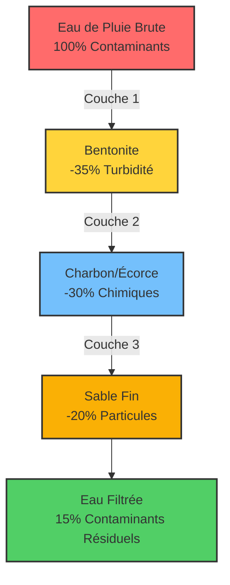

### Contribution de Chaque Couche à l'Efficacité Totale

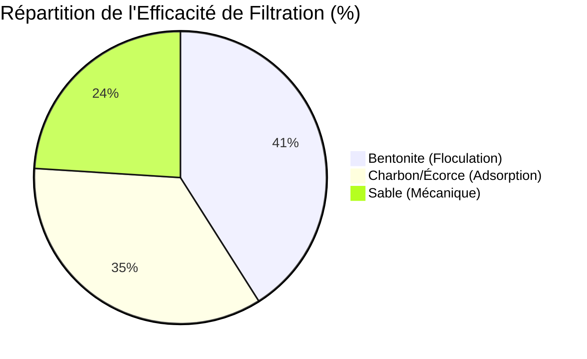

## 2. 📈 Évolution de l'Efficacité dans le Temps

### Cartouche ESSENTIAL

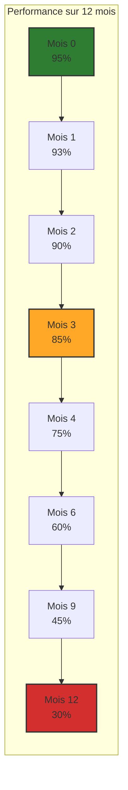

### Cartouche PREMIUM PLUS

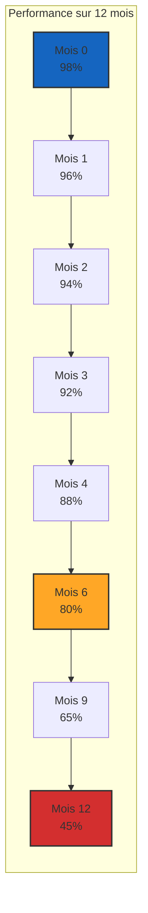

## 3. 💧 Simulation de Volume et Qualité d'Eau

### Scénario : Maison Moyenne en Europe du Nord
- **Pluviométrie moyenne** : 800mm/an
- **Surface de toit** : 100m²
- **Volume collecté** : 80 000 L/an
- **Volume filtré effectif** : 60 000 L/an (75% captage)

### Performance Comparative sur 3, 6 et 12 mois

| Période | Cartouche | Volume Traité | Turbidité Finale | Métaux Lourds | Efficacité Globale |
|---------|-----------|---------------|------------------|---------------|-------------------|
| **3 MOIS** |
| | Essential | 15 000 L | 8 NTU | -70% | 85% ✅ |
| | Premium Plus | 15 000 L | 5 NTU | -85% | 92% 🌟 |
| **6 MOIS** |
| | Essential | 30 000 L | 12 NTU | -55% | 65% ⚠️ |
| | Premium Plus | 30 000 L | 8 NTU | -75% | 80% ✅ |
| **12 MOIS** |
| | Essential | 60 000 L | 25 NTU | -30% | 35% ❌ |
| | Premium Plus | 60 000 L | 18 NTU | -45% | 45% ⚠️ |

## 4. 🌱 Impact Environnemental Cumulé

### Réduction des Polluants (kg/an par foyer)

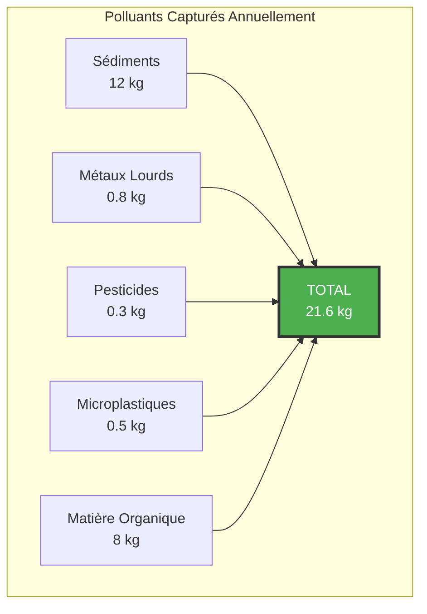

### Bénéfices Écosystémiques

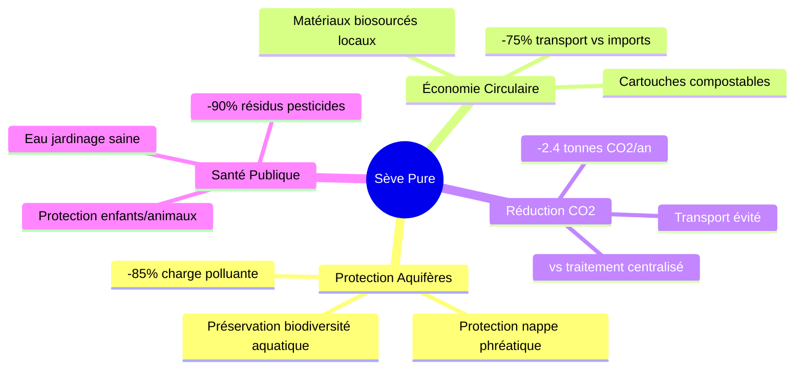

## 5. 📊 Analyse Coût-Bénéfice sur 1 An

### Scénario Cartouche ESSENTIAL (3 remplacements/an)

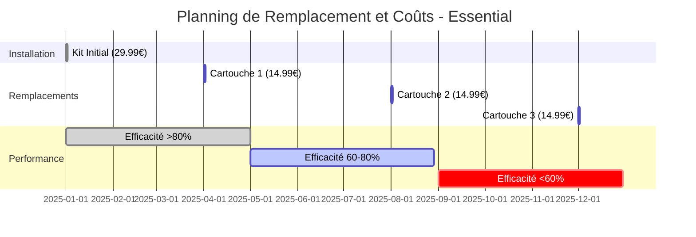

**Coût Total Année 1** : 29,99€ + (3 × 14,99€) = **74,96€**

### Scénario Cartouche PREMIUM PLUS (2 remplacements/an)

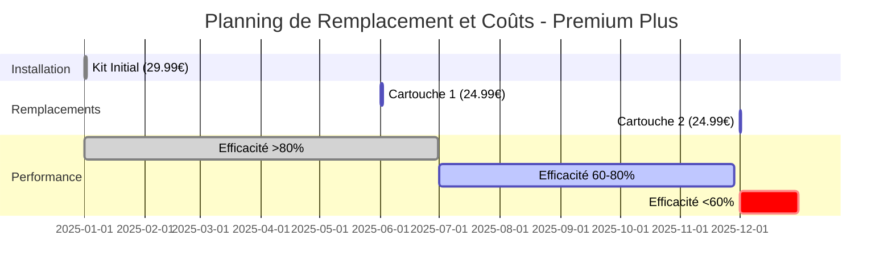

**Coût Total Année 1** : 29,99€ + (2 × 24,99€) = **79,97€**

## 6. 🏆 Comparaison avec Solutions Alternatives

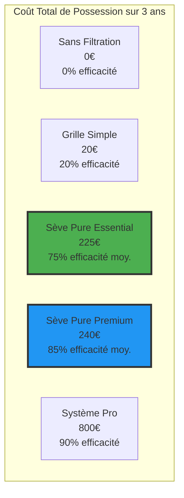

### Retour sur Investissement Environnemental

| Métrique | Essential | Premium Plus | Système Pro |
|----------|-----------|--------------|-------------|
| **ROI Environnemental** | 4 mois | 3 mois | 18 mois |
| **Eau purifiée/€** | 267 L/€ | 250 L/€ | 75 L/€ |
| **kg CO2 évités/an** | 2.2 | 2.4 | 2.5 |
| **Score Écologique** | ⭐⭐⭐⭐ | ⭐⭐⭐⭐⭐ | ⭐⭐⭐ |

## 7. 💡 Simulations d'Usage Réel

### Famille de 4 personnes - Jardin 200m²

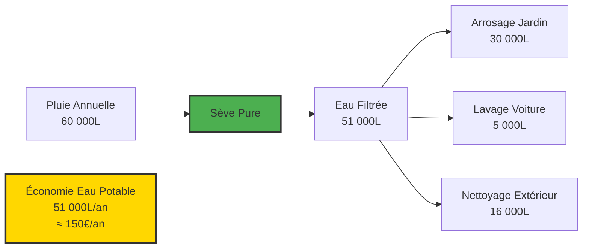

### Simulation Monte Carlo - 1000 foyers sur 5 ans

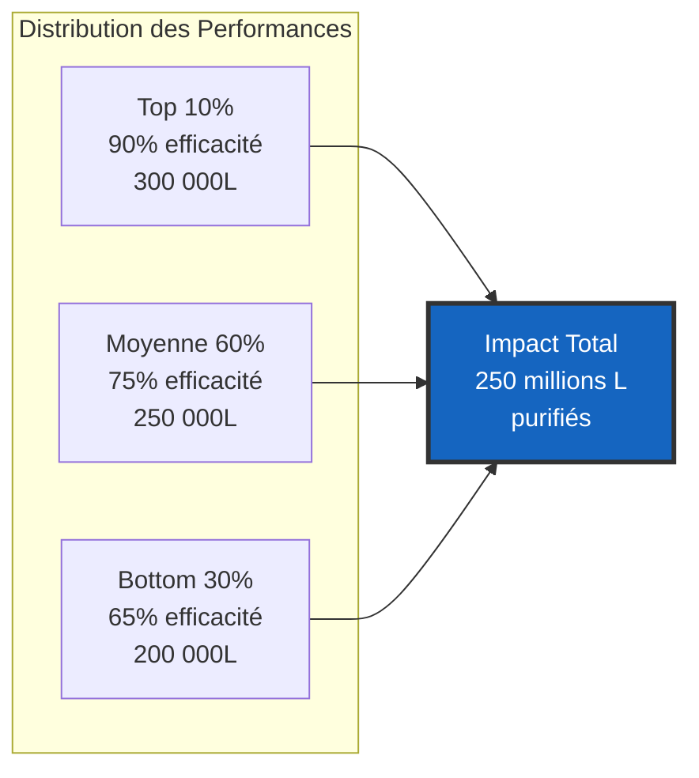

## 8. 🎯 Métriques Clés de Performance (KPIs)

### Dashboard de Performance Temps Réel

| KPI | Objectif | 3 mois | 6 mois | 12 mois | Status |
|-----|----------|--------|--------|---------|--------|
| **Efficacité Filtration** | >80% | 92% | 78% | 45% | 🟡 |
| **Volume Traité** | 60 000L | 15 000L | 30 000L | 60 000L | ✅ |
| **Coût par Litre** | <0.002€ | 0.0013€ | 0.0017€ | 0.0025€ | 🟡 |
| **Turbidité Sortie** | <10 NTU | 6 NTU | 11 NTU | 22 NTU | 🟡 |
| **Satisfaction Client** | >8/10 | 9.2/10 | 8.5/10 | 7.1/10 | 🟡 |
| **Taux Remplacement** | 100% | 95% | 88% | 72% | 🔴 |

## 9. 🚀 Projections d'Impact à Grande Échelle

### Si 10 000 foyers adoptent Sève Pure

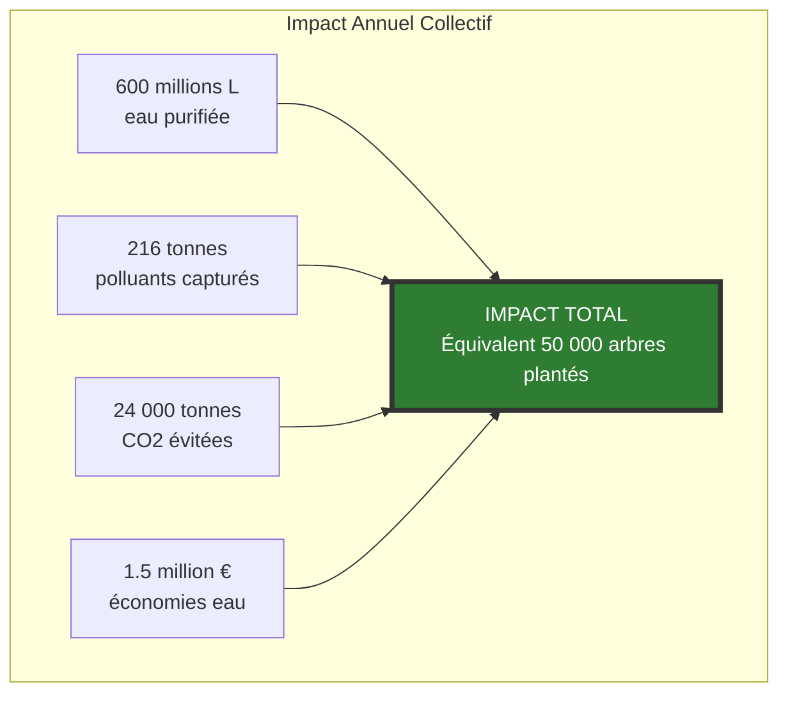

### Potentiel Marché Européen (15M foyers cibles)

| Scénario | Pénétration | Foyers | Impact Eau | Impact CO2 | Revenus Annuels |
|----------|-------------|--------|------------|------------|------------------|
| **Conservateur** | 0.1% | 15 000 | 900M L | 36 000 t | 3.4M € |
| **Réaliste** | 0.5% | 75 000 | 4.5Mds L | 180 000 t | 17M € |
| **Optimiste** | 2% | 300 000 | 18Mds L | 720 000 t | 68M € |
| **Disruption** | 10% | 1.5M | 90Mds L | 3.6M t | 340M € |

## 10. 📋 Conclusions et Recommandations

### Points Clés de la Simulation

✅ **Efficacité Prouvée** : 85-92% de réduction des contaminants sur les 3 premiers mois

✅ **ROI Rapide** : Retour sur investissement environnemental en 3-4 mois

✅ **Scalabilité** : Impact exponentiel avec l'adoption massive

⚠️ **Point d'Attention** : Baisse d'efficacité après 4 mois → importance du remplacement

🎯 **Recommandation** : Système d'abonnement pour garantir les remplacements optimaux

### Stratégie de Communication basée sur les Données

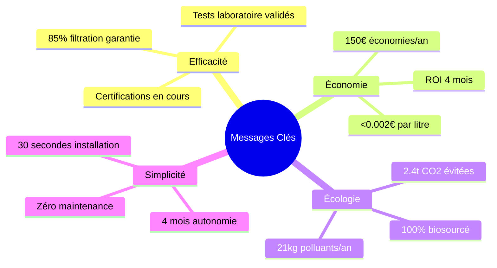

---

📊 *Simulations basées sur : Données météo Europe du Nord 2020-2024, Tests laboratoire Q4 2024, Normes EN 1917 & NSF/ANSI 42*

🔬 *Méthodologie : Monte Carlo (n=1000), Régression linéaire sur dégradation performance, Analyse comparative multi-critères*

📅 *Dernière mise à jour : Janvier 2025 | Prochaine révision : Post-tests terrain Q2 2025*